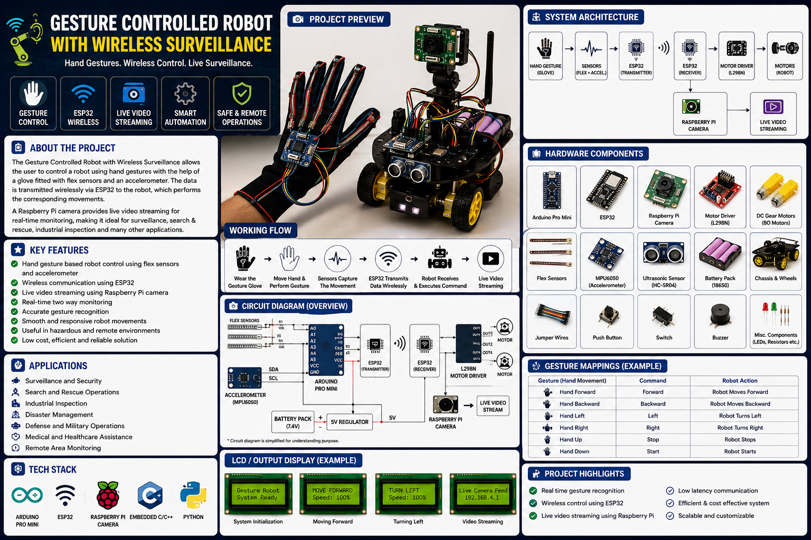

<div align="center">

# 🤖 Gesture Controlled Robot with Wireless Surveillance

### 🖐️ Hand Gesture Control • 📡 Wireless Communication • 📷 Live Video Surveillance

A smart robotic system that allows users to control a mobile robot through **hand gestures** using a sensor-equipped glove, while a **Raspberry Pi 3B+ camera provides real-time wireless video surveillance**.

<p>
  
  
  
  
  
</p>

</div>

---

## 📸 Project Preview

<p align="center">
  
</p>

---

## 📖 Overview

The **Gesture Controlled Robot with Wireless Surveillance** is an embedded robotics project that combines **gesture recognition, wireless communication, motor control, and real-time video surveillance**.

A glove equipped with a **flex sensor and accelerometer** detects the user's hand movements and finger bending. The **ESP32** processes these sensor signals and converts them into commands such as forward, backward, left, right, and stop.

These commands are transmitted wirelessly to the robot, where an **Arduino Uno** controls the robot's motors through an **L298N motor driver**.

At the same time, a **Raspberry Pi 3B+ with a camera module** captures the robot's surroundings and streams live video to the user's device.

The complete system creates a synchronized loop:

**Hand Gesture → Sensor Detection → ESP32 → Wireless Command → Arduino → Motor Control → Robot Movement + Live Surveillance**

---

## 🎯 Objectives

* 🖐️ Control the robot using natural hand gestures
* 📡 Enable wireless communication between the glove and robot
* 🤖 Control robot movement using Arduino and L298N
* 📷 Provide real-time wireless video surveillance
* 🔄 Process sensor data and convert gestures into commands
* 🔋 Support wireless battery-powered operation
* 🛡️ Enable remote monitoring of difficult or hazardous areas
* 🧩 Integrate embedded systems, sensors, robotics, and wireless communication

---

## ✨ Key Features

* 🖐️ **Gesture-Based Control** — Control robot movement using hand gestures
* 📐 **Sensor-Based Detection** — Flex sensor and accelerometer detect hand movement
* 📡 **Wireless Communication** — ESP32 transmits commands wirelessly
* 🤖 **Motor Control** — Arduino Uno controls DC motors through L298N
* 📷 **Live Surveillance** — Raspberry Pi camera provides real-time video
* ⚡ **Real-Time Response** — Robot responds continuously to gesture commands
* 🔋 **Wireless Operation** — Battery-powered robotic system
* 🔄 **Contactless Control** — No traditional wired controller required

---

## 🧩 Hardware Components

| Component               | Purpose                                       |
| ----------------------- | --------------------------------------------- |
| 🔵 Arduino Uno          | Main robot controller                         |
| 🟢 ESP32                | Gesture processing and wireless communication |
| 🖐️ Flex Sensor         | Detects finger bending                        |
| 📐 Accelerometer        | Detects hand tilt and orientation             |
| 🍓 Raspberry Pi 3B+     | Video streaming and surveillance              |
| 📷 Camera Module        | Captures live video                           |
| ⚙️ L298N Motor Driver   | Controls motor speed and direction            |
| 🔄 DC Motors            | Provides robot movement                       |
| 🔋 Li-ion Battery       | Powers the glove/controller                   |
| 🔋 Rechargeable Battery | Powers the robot                              |
| 🔌 Jumper Wires         | Electrical connections                        |
| 🧱 Breadboard           | Prototype circuit assembly                    |
| 🔩 Resistors            | Signal protection and stabilization           |

The report describes the glove controller using the flex sensor, accelerometer and ESP32, while the robot side contains Arduino Uno, L298N, four DC motors and Raspberry Pi 3B+ with camera.

---

## 🏗️ System Architecture

```text
                  👋 USER
                    │
                    ▼
           ┌──────────────────┐
           │  GESTURE GLOVE   │
           │                  │
           │  Flex Sensor     │
           │  Accelerometer   │
           └────────┬─────────┘
                    │
                    ▼
              ┌───────────┐
              │   ESP32   │
              └─────┬─────┘
                    │
             📡 Wireless
                    │
                    ▼
              ┌───────────┐
              │ Arduino   │
              │    Uno    │
              └─────┬─────┘
                    │
                    ▼
              ┌───────────┐
              │   L298N   │
              │   Driver  │
              └─────┬─────┘
                    │
             ┌──────┴──────┐
             ▼      ▼      ▼
           Motor  Motor  Motors
             │      │      │
             └──────┴──────┘
                    │
                    ▼
                🤖 ROBOT


       📷 CAMERA
           │
           ▼
    Raspberry Pi 3B+
           │
           ▼
    📡 Wireless Stream
           │
           ▼
       💻 USER
```

---

## 🔄 Working Principle

### 1️⃣ Gesture Detection

The user wears a glove equipped with a **flex sensor and accelerometer**.

The sensors continuously detect:

* Finger bending
* Hand tilt
* Hand orientation
* Movement direction

---

### 2️⃣ Signal Processing

The ESP32 collects the sensor data and processes it to identify specific gestures.

These gestures are converted into commands such as:

```text
FORWARD
BACKWARD
LEFT
RIGHT
STOP
```

The commands are then transmitted wirelessly to the robot.

---

### 3️⃣ Command Reception

The robot receives the wireless commands through the controller system.

The Arduino interprets the received command and generates the required control signals for the motor driver.

---

### 4️⃣ Motor Control

The **L298N motor driver** receives signals from the Arduino and controls the speed and direction of the DC motors.

```text
Gesture
   ↓
ESP32
   ↓
Wireless Command
   ↓
Arduino Uno
   ↓
L298N
   ↓
DC Motors
   ↓
🤖 Robot Movement
```

---

### 5️⃣ Wireless Surveillance

A **Raspberry Pi 3B+ with a camera module** is mounted on the robot.

The camera captures the surrounding environment and the Raspberry Pi streams the video wirelessly to the user's device.

This allows the operator to see what the robot sees in real time.

---

### 6️⃣ Continuous Monitoring

The user can observe the live video feed while simultaneously controlling the robot through hand gestures.

This creates a continuous feedback loop:

```text
👋 Gesture
    ↓
🤖 Robot Response
    ↓
📷 Camera Feed
    ↓
👨‍💻 User Observation
    ↓
👋 Next Gesture
```

---

## 🖐️ Gesture Control Flow

```text
Hand Movement
      ↓
Flex Sensor + Accelerometer
      ↓
ESP32
      ↓
Gesture Processing
      ↓
Wireless Transmission
      ↓
Arduino Uno
      ↓
L298N Motor Driver
      ↓
DC Motors
      ↓
🤖 Robot Movement
```

---

## 📡 Wireless Communication

The project uses wireless communication for both robot control and surveillance.

### ESP32

The ESP32 transmits gesture commands from the glove to the robot.

### Raspberry Pi

The Raspberry Pi uses Wi-Fi to stream the live camera feed to the operator's device.

```text
             📡 WIRELESS SYSTEM

     Gesture Commands       Video Feed
            │                   │
            ▼                   ▼
         ESP32              Raspberry Pi
            │                   │
            ▼                   ▼
        Robot Control      User Device
```

The report also describes UART communication between the Arduino Uno and Raspberry Pi, with TX/RX and common ground connections.

---

## 🧠 Technology Stack

| Category                 | Technology                  |
| ------------------------ | --------------------------- |
| Microcontroller          | Arduino Uno                 |
| Wireless Controller      | ESP32                       |
| Single Board Computer    | Raspberry Pi 3B+            |
| Programming              | Embedded C/C++              |
| Raspberry Pi Programming | Python                      |
| IDE                      | Arduino IDE                 |
| Simulation               | Proteus                     |
| Communication            | Wi-Fi / UART                |
| Sensors                  | Flex Sensor + Accelerometer |
| Motor Driver             | L298N                       |
| Surveillance             | Raspberry Pi Camera         |

The report specifies Arduino IDE, Embedded C/C++ for sensor and gesture processing, and Python for Raspberry Pi video streaming and network communication.

---

## 🔌 Raspberry Pi & Arduino Communication

The Raspberry Pi and Arduino are used together to coordinate robot movement and surveillance.

### Connections

```text
Arduino TX  ───────►  Raspberry Pi RX

Arduino RX  ◄───────  Raspberry Pi TX

Arduino GND ────────  Raspberry Pi GND
```

The Arduino handles gesture-based motor control while the Raspberry Pi handles video streaming.

---

## 🔋 Power System

The system uses rechargeable batteries to allow wireless operation.

### 🖐️ Glove Controller

Powers:

* ESP32
* Flex Sensor
* Accelerometer

### 🤖 Robot

Powers:

* Arduino Uno
* L298N Motor Driver
* DC Motors
* Raspberry Pi 3B+
* Camera Module

This allows the robot to operate without a constant wired power connection.

---

## 🛠️ Hardware Implementation

The hardware implementation consists of two major sections:

### 🖐️ Glove Controller

```text
Flex Sensor
      +
Accelerometer
      ↓
    ESP32
      ↓
Wireless Command
```

### 🤖 Robot Unit

```text
Wireless Command
       ↓
   Arduino Uno
       ↓
      L298N
       ↓
   DC Motors

Camera
   ↓
Raspberry Pi 3B+
   ↓
Live Video Stream
```

The complete hardware combines the glove controller, robot chassis, motors, sensors, communication modules and surveillance system.

---

## 📊 Project Workflow

```text
       👋 USER
          │
          ▼
   ┌───────────────┐
   │ Hand Gesture   │
   └───────┬───────┘
           │
           ▼
   ┌───────────────┐
   │ Flex Sensor + │
   │ Accelerometer  │
   └───────┬───────┘
           │
           ▼
       ┌───────┐
       │ ESP32 │
       └───┬───┘
           │
           │ Wireless
           ▼
    ┌─────────────┐
    │ Arduino Uno │
    └──────┬──────┘
           │
           ▼
       ┌───────┐
       │ L298N │
       └───┬───┘
           │
           ▼
       🤖 ROBOT


    📷 CAMERA
        │
        ▼
 Raspberry Pi 3B+
        │
        ▼
 📡 Live Video
        │
        ▼
    💻 USER
```

---

## 📷 Surveillance System

The surveillance subsystem consists of:

```text
Camera Module
      ↓
Raspberry Pi 3B+
      ↓
Video Processing
      ↓
Wireless Network
      ↓
User Device
```

The Raspberry Pi 3B+ provides the processing required for real-time video streaming and communicates with the Arduino to coordinate the robot and surveillance operations.

---

## 🧪 Testing & Results

The project was designed and tested as a working prototype combining gesture control and wireless surveillance.

The report describes the following expected system behavior:

* ✅ Flex sensor detects finger movement
* ✅ Accelerometer detects hand orientation
* ✅ ESP32 processes gesture data
* ✅ Commands are transmitted wirelessly
* ✅ Arduino receives movement commands
* ✅ L298N controls motor direction and speed
* ✅ Robot responds to gestures
* ✅ Raspberry Pi captures camera footage
* ✅ Live video is streamed wirelessly
* ✅ User can monitor the robot remotely

The testing section reports successful gesture-based movement, wireless communication, motor response and live video streaming.

---

## 🌍 Applications

### 🛡️ Surveillance

Remote monitoring of areas where continuous human presence may be difficult.

### 🚨 Search & Rescue

Can be used for exploring difficult or hazardous locations.

### 🏭 Industrial Inspection

Potential use for remote inspection of industrial environments.

### 🌋 Disaster Management

Can assist in remotely monitoring dangerous areas.

### 🗺️ Remote Exploration

Useful for exploring locations that may be difficult or unsafe for humans.

### 🎓 Education & Research

Demonstrates practical concepts in:

* Robotics
* Embedded Systems
* Wireless Communication
* Sensors
* Microcontrollers
* Real-Time Video Streaming

---

## 🚀 Future Scope

The project can be further enhanced with:

* 📡 Long-range communication
* 🤖 AI/ML-based gesture recognition
* 🧭 Ultrasonic or LiDAR obstacle detection
* 🌙 Night-vision surveillance
* 🔋 Solar charging / improved battery system
* 📱 Dedicated mobile application
* 🎙️ Voice-controlled operation
* 🧠 Autonomous navigation

These are proposed future enhancements rather than features of the current prototype.

---

## 🧠 Skills Demonstrated

<p align="center">

`Embedded Systems` • `Arduino` • `ESP32` • `Raspberry Pi` • `Robotics`
`Sensor Interfacing` • `Gesture Recognition` • `Wireless Communication`
`Motor Control` • `Python` • `Embedded C/C++` • `Camera Integration`

</p>

---

## 📁 Suggested Repository Structure

```text
Gesture-Controlled-Robot/
│──📄 project-preview.png
│──📄 block-diagram.jpeg
└── README.md
```

---

## 💻 Software Requirements

Before running the project, install/configure:

* Arduino IDE
* ESP32 Board Package
* Arduino Uno support
* Python on Raspberry Pi
* Raspberry Pi Camera support
* Required Python libraries for video streaming
* Proteus for circuit simulation (optional)

---

## ⚙️ Basic Setup

### Step 1 — Program ESP32

Open the ESP32 code in Arduino IDE and upload it to the glove controller.

### Step 2 — Program Arduino

Upload the robot-control `.ino` sketch to Arduino Uno.

### Step 3 — Configure Raspberry Pi

Connect the camera to Raspberry Pi 3B+ and configure the Python video-streaming program.

### Step 4 — Connect Hardware

Connect the sensors, motor driver, motors and power supply according to the circuit diagram.

### Step 5 — Test Gestures

Perform hand gestures and observe the corresponding robot movement.

### Step 6 — Monitor Video

Open the wireless video stream on the user device and monitor the robot's surroundings.

---

## 📚 Learning Outcomes

This project provided hands-on experience in:

* Embedded system development
* Robotics
* Sensor interfacing
* Gesture recognition
* Wireless communication
* Arduino programming
* ESP32 programming
* Raspberry Pi
* Python programming
* Motor control
* Camera integration
* Real-time systems
* Hardware-software integration
* Circuit design and debugging

---

## 📖 Project Highlights

```text
🖐️ Gesture Controlled
        +
📡 Wireless Communication
        +
🤖 Robotic Movement
        +
📷 Live Surveillance
        =
🚀 Smart Remote-Controlled Robot
```

---

## 👥 Project Team

**Department of Electronics & Communication Engineering**

**Session: 2025–26**

* Esha Chaturvedi
* Paridhi Agrawal

---

<div align="center">

### 🤖 Gesture → Wireless Command → Robot Movement → Live Surveillance

**Built with Arduino • ESP32 • Raspberry Pi • Sensors • Embedded C/C++ • Python**

⭐ If you found this project interesting, consider giving the repository a star!

</div>
